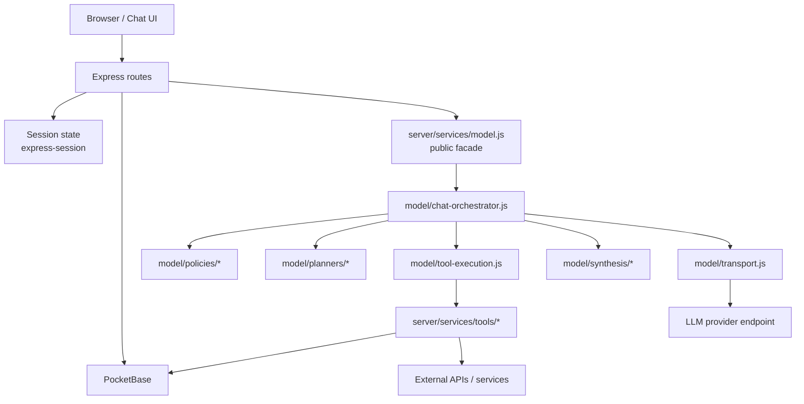
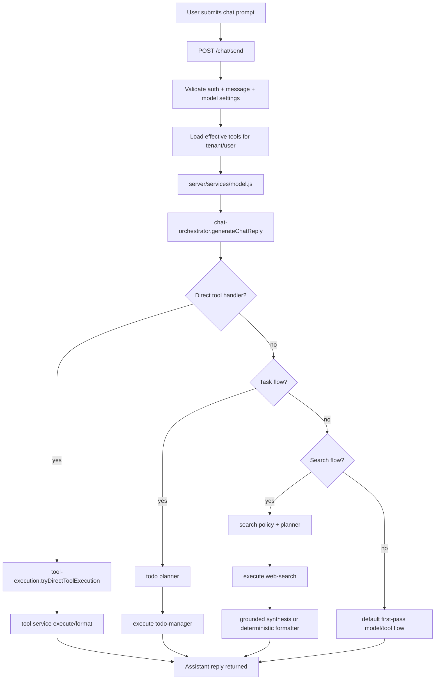

# Architecture

## Runtime Model

Pikori is currently a server-rendered multi-page application:

- Express handles routing and server actions.
- EJS renders the shell and page markup.
- PocketBase is the durable backend for auth, tenants, settings, tools, and todos.
- A shared inline script in `views/layout.ejs` powers interactive behavior such as:
  - async sign-in
  - sidebar collapse state
  - model settings save
  - memory settings save
  - chat send/reset
  - memory deletion UI
  - toast notifications

The app is not a client-side SPA in the primary implementation.

## Main Files

- `server.js`
  Main application entry point and route registration.
- `server/routes/*.js`
  Route handlers split by concern.
- `server/lib/render.js`
  Protected route handling and page rendering helpers.
- `server/lib/session.js`
  Session mapping and chat session helpers.
- `server/services/model.js`
  Public model-service facade that keeps the stable exports used by routes and delegates to the modular chat/model subsystem.
- `server/services/model/chat-orchestrator.js`
  Top-level chat workflow coordinator for task flows, search flows, and default model/tool execution paths.
- `server/services/model/transport.js`
  Model HTTP transport helpers, endpoint resolution, request payload submission, and connection checks.
- `server/services/model/policies/*.js`
  Search and task classification / policy helpers.
- `server/services/model/planners/*.js`
  Dedicated planner prompt builders and planner-pass execution for search and todo flows.
- `server/services/model/synthesis/*.js`
  Grounded tool follow-up and web-search synthesis helpers.
- `server/services/model/tool-execution.js`
  Generic enabled-tool mapping, direct execution checks, and tool invocation runtime.
- `server/services/model/tool-confirmation.js`
  Confirmation-required response builders for non-autonomous tools.
- `server/services/todos.js`
  ToDo mapping, validation, time-zone conversion, and persistence helpers.
- `server/services/tool-definitions.js`
  Tool-definition, tenant-tool, and user-preference data access.
- `server/tools/loader.js`
  Effective tool loading for the active tenant and user.
- `server/pocketbase.js`
  PocketBase integration for auth, tenants, memberships, models, and settings.
- `server/services/docs.js`
  Markdown loading and simple HTML rendering for the in-app docs section.
- `views/layout.ejs`
  Outer shell and shared script logic.
- `views/pages/*.ejs`
  Page templates.
- `views/partials/*.ejs`
  Shared UI fragments.
- `css/styles.css`
  Shared styling.

## Visual Architecture

### High-Level Runtime Diagram

### Chat Prompt Flow Diagram

## Request Flow

### Initial Request

1. Browser requests a route.
2. Express resolves auth and tenant requirements.
3. Feature authorization is checked against the session.
4. Route-specific data is loaded when needed.
5. `renderRoute(...)` builds the view model.
6. `layout.ejs` renders the shell and selected page.
7. Shared client logic enhances the rendered page.

### Settings Save

For the persisted Settings sections:

1. Client intercepts the form submit.
2. Client POSTs to a server route such as:
   - `/settings/model`
   - `/settings/memory`
3. Server validates again.
4. Server persists changes to PocketBase.
5. Server updates session state.
6. Client shows toast feedback.

### Chat Send

1. User submits a prompt on `/chat`.
2. Client adds an optimistic user bubble and pending assistant bubble.
3. Client POSTs to `/chat/send`.
4. Server reads model and memory settings from session.
5. Server loads effective tools for the current tenant and user.
6. `generateChatReply(...)` decides whether to:
   - answer directly
   - execute a tool directly
   - run a task-planning pass
   - run a search-planning pass
   - execute a parsed tool call from the first pass
7. Server applies any returned tool state patch to the chat session.
8. Server appends the assistant reply to session chat history.
9. Client re-renders the thread from the returned messages.

### ToDo Save

1. User submits the ToDo form on `/todos`.
2. Server normalizes the payload into tenant-scoped data.
3. Server validates status, ownership, and tenant access.
4. Server creates or updates the PocketBase todo record.
5. Browser is redirected back to `/todos`.

### Tool Preference Save

1. User toggles a tool on `/tools`.
2. Server verifies that the tenant tool exists and is active.
3. Server upserts a `user_tool_preferences` record for the current user and tenant.
4. Browser is redirected back to `/tools`.

## State Layers

Pikori currently uses three main state layers.

### 1. Server Session

Stored via `express-session`.

Used for:

- authenticated user identity
- feature authorization flags
- API endpoint metadata
- active tenant context
- tenant member directory
- loaded settings
- current chat history
- pending ToDo follow-up state

Session cookie:

- name: `pikori.sid`

### 2. PocketBase

Used for durable cross-session storage:

- authentication
- feature authorization
- model catalog
- user settings
- tenants and memberships
- tool definitions
- tenant tool activation/configuration
- per-user tool preferences
- todos

### 3. Browser Local Storage

Used for client-local state that is intentionally not persisted to PocketBase:

- sidebar minimized state
- protected local memory list

Current keys:

- `pikori.sidebar.minimized`
- `pikori.memories`

## Rendering Strategy

Most pages are rendered server-side with the latest session state.

Some interactions update in place without a full page refresh:

- chat thread updates after message send
- settings save responses
- auth form submission feedback

Other flows remain traditional server redirects:

- todo create/update
- tool preference toggles

## In-App Docs

Documentation is rendered inside the app through:

- `GET /docs`
- `GET /docs/:slug`

The docs renderer reads Markdown files from `docs/` and converts a limited Markdown subset into HTML.

## Legacy Code

There is older frontend-only code under `legacy-ui-comps/`. It remains in the repo, but the current working product is the Express + EJS app.
