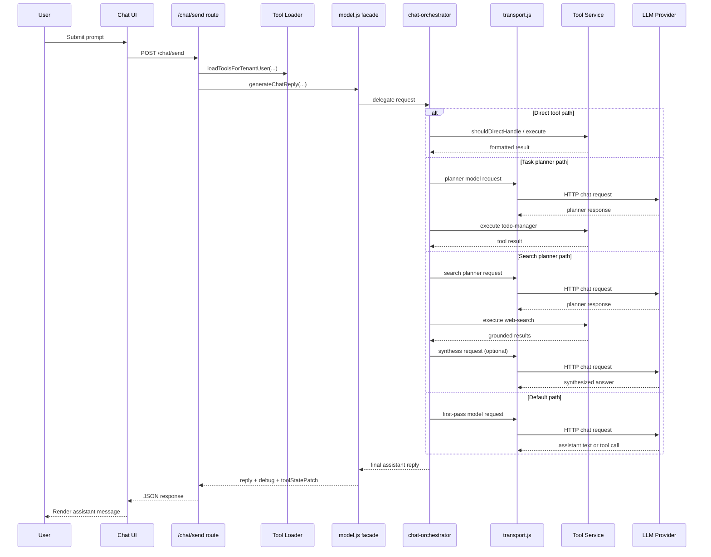
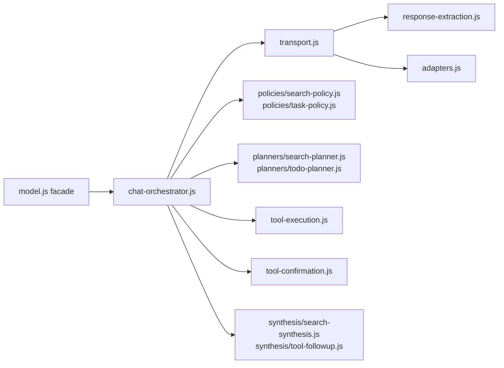
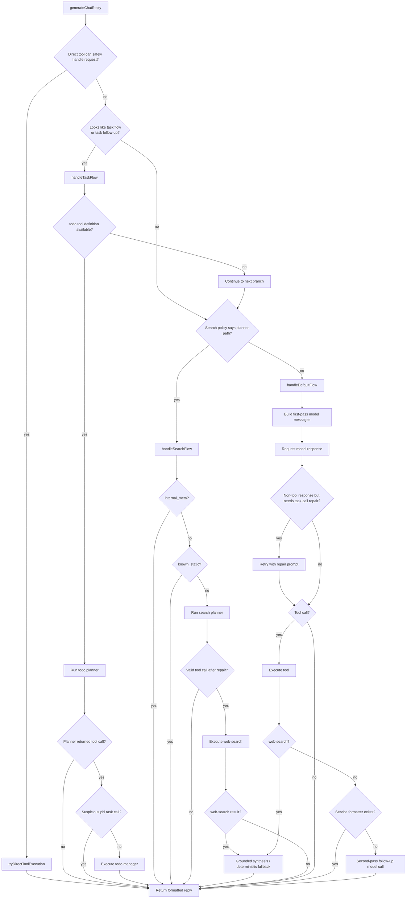

# LLM And Chat

## Overview

The Chat view is backed by:

- server session chat history
- model settings loaded from `user_settings`
- memory settings loaded from `user_settings`
- tenant-aware tool definitions loaded from PocketBase
- an Ollama-compatible or OpenAI-compatible HTTP chat call

Chat generation currently lives in:

- `server/routes/chat.js`
- `server/prompts/chat.js`
- `server/services/model.js`
- `server/services/model-adapters/*.js`

## Chat UX

Current behavior:

- chat is empty by default
- a centered friendly prompt tells the user to type below
- user messages are appended to the thread
- a temporary assistant spinner bubble appears while waiting
- assistant replies are appended after the server returns
- `+ Session` clears the chat history for the current login session

Chat history remains available while the user navigates around the app, until:

- logout
- or `+ Session`

## Routes

### `POST /chat/send`

Responsibilities:

1. Validate sign-in state.
2. Validate message text.
3. Validate that model settings are usable.
4. Append the user message into `req.session.chat.messages`.
5. Load enabled tools for the active tenant and user.
6. Generate a reply through `generateChatReply(...)`.
7. Apply any tool-related session state patch.
8. Append the assistant reply into session.
9. Return the new messages plus debug metadata as JSON.

### `POST /chat/reset`

Responsibilities:

- clear `req.session.chat.messages`
- clear pending ToDo follow-up state stored in session

## Visual Chat Flow

### End-to-End Chat Processing



### Model Subsystem Module Map



### Orchestrator Decision Tree



## Prompt Assembly

Prompt construction happens in:

- `server/prompts/chat.js`
  functions such as `buildChatSystemPrompt(...)` and `buildChatMessages(...)`

Reply generation, tool planning, and synthesis happen in:

- `server/services/model.js`
  main function: `generateChatReply(...)`

Model adapters are selected by registry metadata:

- `server/services/model-registry.js`
- `server/services/model-adapters/default.js`
- `server/services/model-adapters/deepseek.js`
- `server/services/model-adapters/phi4-mini.js`

## Persona And Memory Context

The server injects these settings into the system prompt:

- `Bot name`
- `Bot description`
- `User name`
- `User description` if present

The session-backed memory settings are used for naming and persona, but the local browser memory list is still not injected into the model prompt.

## Message History Sent To The Model

The base payload includes:

- one `system` message
- the session chat history mapped into:
  - `user`
  - `assistant`

Depending on the path taken, extra system/user messages can be added for:

- task-planning passes
- search-planning passes
- tool-result synthesis
- repair retries when the model failed to return a valid tool call

## Model Payload And Endpoint Resolution

Current request shape:

```json
{
  "model": "<selected-model>",
  "stream": false,
  "messages": [
    {
      "role": "system",
      "content": "..."
    },
    {
      "role": "user",
      "content": "..."
    }
  ]
}
```

If the selected model definition enables `thinking` and the active adapter is `default`, the request also includes:

```json
{
  "think": true
}
```

Endpoint resolution currently works like this:

- if `apiType` is `openai-completions`, append or preserve `/v1/chat/completions`
- otherwise append or preserve `/api/chat`

## Response Parsing

The server currently accepts either of these shapes:

- `data.message.content`
- `data.choices[0].message.content`

The `phi4-mini` adapter also accepts several text-style fallback fields when needed.

## Tool-Aware Chat Behavior

The app now has active tool orchestration in chat.

Current high-level flow:

1. Load enabled tools for the active tenant and current user.
2. Give the model prompt definitions for enabled tools.
3. Short-circuit some requests directly through a tool service when the tool can handle them safely.
4. For likely ToDo requests, run a dedicated task-planning pass.
5. For likely web-search requests, run a dedicated search-planning pass.
6. Execute approved autonomous tools.
7. Format or synthesize the tool result back into an assistant reply.

### Current Tool Paths

- `todo-manager`
  Handles create, update, archive, and query flows for the signed-in user's tenant-scoped todos.
- `web-search`
  Handles grounded current-event, lookup, schedule, availability, and event-style searches.

### Tool Safety Rules

- only enabled tools are exposed
- only autonomous tools can execute without extra confirmation
- tool services can deny execution through `shouldAutoExecute(...)`
- denied tool requests return a user-facing fallback instead of silently executing

### Search Synthesis

`web-search` uses a dedicated synthesis pass:

- search results are reduced into `grounded_facts`
- the model is asked to answer only from grounded evidence
- if the model still produces a weak refusal, the server falls back to the deterministic formatter in `server/services/tools/web-search.js`

### ToDo Follow-Up State

`todo-manager` can return a `toolStatePatch` that updates:

- `req.session.chat.pendingTodoFollowup`
- `req.session.chat.pendingTodoQuery`

This is used to support follow-up questions such as missing due dates or disambiguation.

## Debugging

Set this environment variable to enable verbose tool-flow logging:

- `PIKORI_TOOL_DEBUG=1`

The server then logs events such as:

- first-pass model requests
- planner requests and responses
- tool execution
- search synthesis
- tool denial fallbacks

## Current Limitations

- only a subset of registered tools have executable services today
- chat history is still session-scoped, not durable across logout
- local protected memories are still browser-local only
- tool execution depends on correct tenant tool setup and user preferences in PocketBase
- planner and orchestration flows now have targeted unit coverage, but there is still no authenticated end-to-end tool-flow test with real PocketBase-backed session state
llbacks

## Current Limitations

- only a subset of registered tools have executable services today
- chat history is still session-scoped, not durable across logout
- local protected memories are still browser-local only
- tool execution depends on correct tenant tool setup and user preferences in PocketBase
- there are no automated tests covering the current planner/synthesis flows
